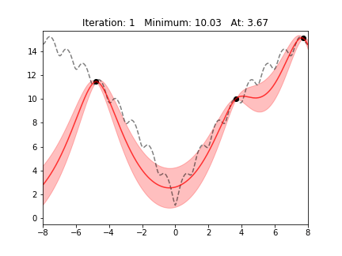
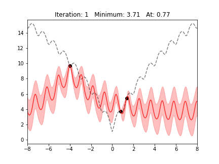
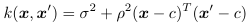
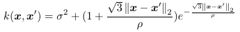
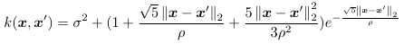
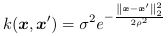
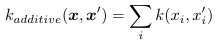
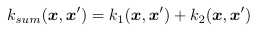
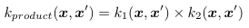
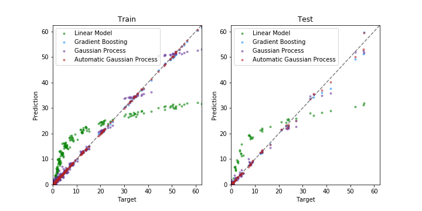

# PTGPBO: Bayesian Optimisation with Gaussian Processes

PTGPBO is a collection of tools for using Bayesian Optimisation with Gaussian process priors.
Below, there are examples of Bayesian Optimisation being used to find the minimum 
of the 1-dimensional Ackley [1] function. In each example, a Gaussian process with a different 
kernel was used. The Gaussian processes can also be used for other tasks, e.g.
regression problems. Everything is implemented using the PyTorch library.

  
  

## Kernels

Kernels are functions of the form k(x, x'). They take two points in a space and return the 
similarity/distance between them. All the kernels are found in `kernel.py`. Definitions for all
the kernels below were found in [2] and [3]. Details on combining kernels were found in [2].
The following basic kernels are included.

#### Linear Kernel

  

#### Matern32 Kernel

  

#### Matern52 Kernel

  

#### Squared Exponential Kernel

  

#### Periodic Kernel

  

### Additive and Multiplicative Kernels

There are additive and multiplicative versions of each of these kernels. These kernels act on each
dimension seperately and the similarities/distances for each dimension are added or multiplied 
together. For some kernel function k, an additive kernel can be written as

  

and a multiplicative kernel can be written as

  

### Combining Kernels

Kernels can be combined by adding or multiplying their outputs. All the kernels have `__add__` and
`__mul__` methods so that instances of any kernel class can be combined into sum kernels or product 
kernels by adding or multiplying them. For a pair of kernel functions k1 and k2, a sum kernel can
be written as

  

and a product kernel can be written as

  

## Gaussian Process Models

Each of the Gaussian process models has a scikit-learn style API with a `fit` method and a `predict` 
method. There are three different types that are all located in `gaussian_process.py`. Each Gaussian 
process has inputs x of shape (n, p) and targets y of shape (n, 1).

#### Gaussian Process

This is the default Gaussian process model. It is initialised with a kernel and an alpha value. Assuming 
the training data or objective function is noisy, alpha should be set to the standard deviation of the
noise. Alpha should be positive (but possibly very small) even if there is no noise.

#### Automatic Gaussian Process

This model uses a naive search method to automatically find a good kernel by trying different combinations 
of kernels from a given list of kernels. It is initialised with an alpha value, a kernel list and an optional 
initial kernel, which is the starting point for the kernel search. The `fit` method of this model takes an
additional `kernel_search_iters` argmument. The idea of searching for kernels comes from [2], although the 
naive kernel search method that this model uses is not as sophisticated as approaches in [2].

#### Spatio-Temporal Gaussian Process

As well as positions (in space) x, this model takes in times as inputs. The time input should be of shape (n, 1).
This model is initialised with a space kernel and a time kernel as well as an alpha value. The space kernel measures 
similarity between positions and the time kernel measures similarity between times. The combined similarity is the 
product of the spatial and temporal similarities. This model is intended for use with the Dynamic Bayes Optimiser 
(see below) and comes from [4].

## Optimisers

There are two different optimisers that are intended for different types of problems. Both are found in 
`bayes_opt.py`. Both are intended for minimisation problems where the objective function is expensive to 
evaluate and low-dimensional (10-20 dimensions is pushing it). Iterations of the optimisers take longer as the 
iteration number increases. It is recommended to do no more than a few hundred iterations.

#### Bayes Optimiser

This optimiser uses regular Bayesian optimisation. The optimiser is initialised with a Gaussian process model, an
acquisition function and an epsilon value. The acquisition function is used to decide where to evaluate the 
objective function each iteration. The Bayes Optimiser should be used with the acquisition function called `Acquisition`,
also found in `bayes_opt.py`. The epsilon value determines how close together any two points at which to sample 
the objective function can be. This can be left at the default value.

#### Dynamic Bayes Optimiser

This optimiser is intended for objective functions that change over time, i.e. dynamic objective functions. 
The optimiser is initialised with a Gaussian process model (the spatio-temporal model), an acquisition function 
and an epsilon value. The Dynamic Bayes Optimiser should be used with the acquisition function called 
`DynamicAcquisition`, found in `bayes_opt.py`.

## Examples

`ackley_gif.py`

The BayesOptimiser is used to minimise the 1-dimensional Ackley function. This example reproduces the gif at the top of
this README.

`ackley_test.py`

This runs the BayesOptimiser on the n-dimensional Ackley function.

`regression_example.py`

A Gaussian process with an additive Matern32 kernel and an automatic Gaussian process (that selected a product of two 
additive periodic kernels) were tested on a yacht hydrodynamics regression problem [5]. The predictions from each 
Gaussian process were compared to the predictions from an ordinary least squares linear model and a gradient boosting
regressor from scikit-learn [6].

  

## Features To Add
- Support for training on GPUs
- Support for objective functions with additional arguments
- Gradients for multiplicative kernels
- Automatic spatio-temporal gaussian process model
- More acquisition functions

## References
[1] Ackley, D. H. (1987) "A connectionist machine for genetic hillclimbing", Kluwer Academic Publishers, Boston MA.

[2] Duvenaud, D. K. (2014) "Automatic Model Construction with Gaussian Processes",
retreived from [here](http://www.cs.toronto.edu/~duvenaud/cookbook/index.html)

[3] Williams, C. K., & Rasmussen, C. E. (2006). "Gaussian processes for machine learning".
Cambridge, MA: MIT press.

[4] Nyikosa, F. M., Osborne, M. A., & Roberts, S. J. (2018). "Bayesian Optimization for Dynamic Problems". 
arXiv preprint [arXiv:1803.03432](https://arxiv.org/abs/1803.03432).

[5] Dua, D. and Graff, C. (2019). UCI Machine Learning Repository [https://archive.ics.uci.edu/ml/datasets/Yacht+Hydrodynamics]. 
Irvine, CA: University of California, School of Information and Computer Science.

[6] Pedregosa F. et al., (2011) "Scikit-learn: Machine Learning in Python", JMLR 12, pp. 2825-2830 [https://scikit-learn.org]
